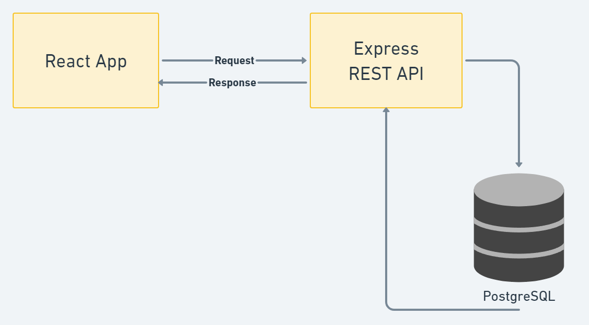
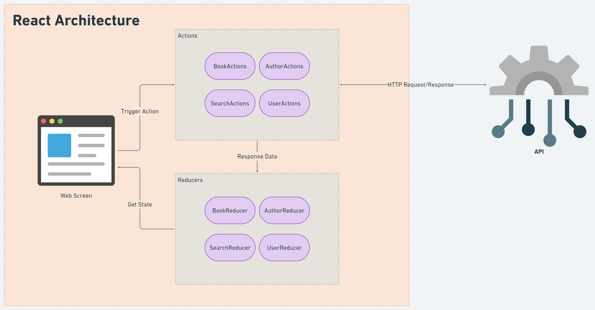
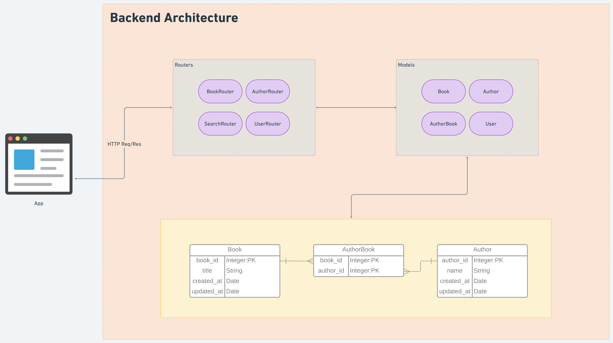

# Digital Library Management

Simple digital library app built with React in the front-end, Express in the backend and PostgreSQL database.

# Prerequisites

## Docker
If you have [Docker](https://www.docker.com "Docker Homepage") installed you do not need to install anything else.
## NodeJS, PostgreSQL
Otherwise, you must have [NodeJS](https://nodejs.org "NodeJS Homepage") and [PostgreSQL](https://www.postgresql.org/download/ "Postgres Downloads") installed on your machine. And, you have to be running postgres before running the API server.

# Configuration
You do not have to configure anything to test the app since default values are used in ```backend/utils/config.js``` file. You also can use a .env file to configure yourself.
## .env
Create a .env file in the root directory and enter the following environment variables.
```
PORT=<Express listening PORT> //Defaults to 5000
POSTGRES_DB_NAME=<Database name>
POSTGRES_PORT=<Database PORT>
POSTGRES_USERNAME=<Database Username>
POSTGRES_PASSWORD=<Database Password>
JWT_SECRET=<Some random string for JWT Token seed>
```
## docker-compose.yml
If you are using docker, you need to configure Postgres environment variables before building the containers.
```
enviorenment:
  POSTGRES_DB_NAME=<Database name>
  POSTGRES_USERNAME=<Database Username>
  POSTGRES_PASSWORD=<Database Password>
ports:
  - '5432:5432'
```
# Getting Started

## Docker
The following command will build both the Postgres and NodeJS containers and start running the server in production mode on ```localhost:5000```
```
docker compose up
```

## NPM
### Development Mode
The following command installs all dependencies for both frontend and backend packages.
```javascript
npm run install-all
```
After installing all dependencies you can run the app in development mode with the following command:
```javascript
npm run dev
```
In development mode the app serves on  ```localhost:3000```
### Production Mode
The following command installs all dependencies and builds the app and starts serving on ```localhost:5000```
```javascript
npm run serve
```

# Software Architecture
## App Architecture

## React Front-end Architecture

## Backend Architecture

